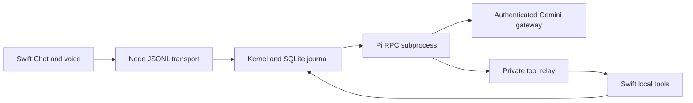

# Local agent runtime

Swift launches the bundled Node runtime through `AgentRuntimeProcess`. Node receives typed JSONL commands and owns the durable session, run and conversation journal. Its kernel coordinates execution policy, adapter bindings and tool capabilities. Pi performs the model/tool loop; Swift executes the retained desktop tools against local app state.

## Process and control flow

`PiMonoAdapter.start` launches Pi in RPC mode with the bundled Intentive extension and the pinned Gemini model. Built-in tools, arbitrary skills, context files and other extensions are disabled. The adapter scrubs provider API-key environment variables before supplying the Firebase token to the managed extension. The adapter's old file-header description of an in-process session is superseded by the actual subprocess implementation.

## Durable ownership

SQLite stores session identity and owner IDs separately from execution attempts, events and artifacts. Conversation turns are journal records; UI projections and transient model sessions are consumers of that authority. An accepted tool result must retain the run/invocation identity expected by the kernel rather than being treated as an unrelated chat message.

Owner-scoped work is unavailable before Swift's owner handshake. Token refresh can establish the first owner or refresh the same owner, but cannot replace an active owner. Revocation commits the inert authority before terminalization callbacks and requires an exact previous-owner receipt for a duplicate request. This prevents delayed owner-A work from being admitted after switching to owner B.

## Change and test seams

Extend transport shapes in `protocol.ts`, execution policy in the kernel, and actual desktop effects in the Swift tool owner. Read [desktop guidance](../../INSTRUCTIONS.md#desktop-guidance) before changing these boundaries. Runtime-owner tests exercise uninitialized admission, mismatched refresh and correlated revocation; journal tests cover durable turns. See [Chat and voice](../workflows/chat-voice.md) for how visible conversations reach these components.

## Source evidence

- [desktop/macos/agent/src/adapters/pi-mono.ts](../../../desktop/macos/agent/src/adapters/pi-mono.ts#L260-L335)
- [desktop/macos/agent/src/runtime/runtime-owner-authority.ts](../../../desktop/macos/agent/src/runtime/runtime-owner-authority.ts)
- [desktop/macos/agent/tests/runtime-owner-authority.test.ts](../../../desktop/macos/agent/tests/runtime-owner-authority.test.ts)
- [desktop/macos/agent/src/runtime/sqlite-store.ts](../../../desktop/macos/agent/src/runtime/sqlite-store.ts#L98-L135)
- [desktop/macos/agent/src/runtime/conversation-journal.ts](../../../desktop/macos/agent/src/runtime/conversation-journal.ts)
- [desktop/macos/agent/tests/conversation-journal.test.ts](../../../desktop/macos/agent/tests/conversation-journal.test.ts)

[Start here](../../quickstart.md) · [Authored guidance](../../INSTRUCTIONS.md)
