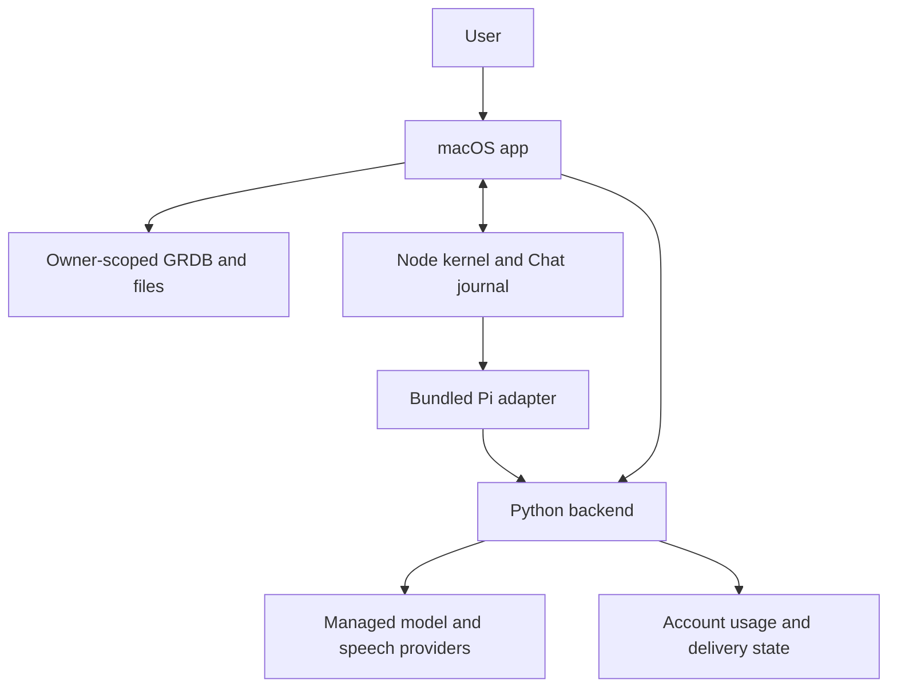

# System architecture

Intentive's active product combines a native macOS app, a bundled Node agent runtime, and a managed Python backend. The user-facing capture, archive and tool effects belong to the Mac. Node coordinates agent execution and stores Chat history. The backend authenticates requests, provides managed inference and retains account and delivery control data.

## Authority map

| Concern | Durable owner | Compute or presentation |
| --- | --- | --- |
| Conversations and transcript archive | Mac stores on GRDB | Local transcription or transient cloud STT; local views |
| Memory lifecycle and vectors | Mac MemoryStorage | Backend candidate compute; local validation and commit |
| Tasks and simple goals | Mac component stores | Home, Chat and voice tools |
| Ordinary Chat identity and accepted turns | Node SQLite catalog/journal | Swift Home and managed Pi/Gemini |
| Account, entitlements, usage and updates | Backend control-plane stores | Authenticated clients and release workflows |

The distinction matters on failure: an unavailable compute provider can prevent enrichment or a reply, but it does not become permission to reload product data from a retired hosted authority. Account switching must fence work at both the Mac and Node boundaries.

## Read by task

- [Capture and transcription](../workflows/capture-transcription.md): audio becomes a local conversation.
- [Chat, tools and voice](../workflows/chat-voice.md): a user turn becomes bounded agent work.
- [Memory](../workflows/memory.md): proposals become durable local assertions.
- [Account lifecycle](../workflows/account-lifecycle.md): export and deletion cross different owners.
- [Delivery](../operations/releases.md): exact source becomes a qualified artifact or deployment.

Before changing capture, metering, playback or voice recovery, read the [authored runtime reliability boundaries](../../INSTRUCTIONS.md#runtime-reliability-boundaries). They preserve the required model routing, threading, delivery, acknowledgement and recovery rules.

[Provenance and product constraints](../../INSTRUCTIONS.md#provenance-and-ownership) are authored decisions. Inherited Windows sources are excluded from this active-product wiki. The Company section is reserved structure only. Source code proves implementation, not production readiness; open qualification obligations remain in the brief.

## Source evidence

- [backend/main.py](../../../backend/main.py#L95-L119)
- [desktop/macos/Desktop/Sources/Rewind/Core/MemoryStorage.swift](../../../desktop/macos/Desktop/Sources/Rewind/Core/MemoryStorage.swift)
- [backend/routers/memory_compute.py](../../../backend/routers/memory_compute.py)
- [desktop/macos/agent/src/adapters/pi-mono.ts](../../../desktop/macos/agent/src/adapters/pi-mono.ts#L260-L335)
- [desktop/macos/agent/src/runtime/conversation-journal.ts](../../../desktop/macos/agent/src/runtime/conversation-journal.ts)

[Start here](../../quickstart.md) · [Authored guidance](../../INSTRUCTIONS.md)
