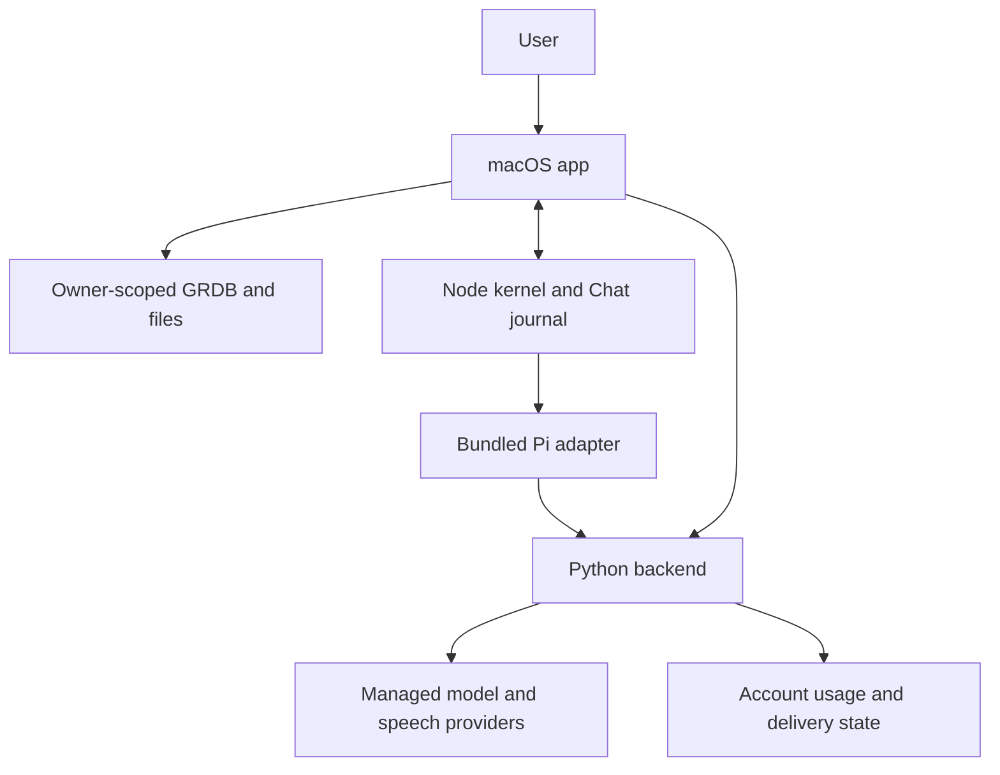

# System architecture

Intentive's active product combines a native macOS app, a bundled Node agent runtime, and a managed Python backend. The user-facing capture, archive and tool effects belong to the Mac. Node coordinates agent execution and stores Chat history. The backend authenticates requests, provides managed inference and retains account and delivery control data.

```mermaid
flowchart TB
  User[User] --> Mac[macOS app]
  Mac --> Local[Owner-scoped GRDB and files]
  Mac <--> Node[Node kernel and Chat journal]
  Node --> Pi[Bundled Pi adapter]
  Pi --> API[Python backend]
  Mac --> API
  API --> Models[Managed model and speech providers]
  API --> Control[Account usage and delivery state]
```

## Authority map

| Concern | Durable owner | Compute or presentation |
| --- | --- | --- |
| Conversations and transcript archive | Mac stores on GRDB | Local transcription or transient cloud STT; local views |
| Memory lifecycle and vectors | Mac MemoryStorage | Backend candidate compute; local validation and commit |
| Tasks and simple goals | Mac component stores | Home, Chat and voice tools |
| Ordinary Chat identity and accepted turns | Node SQLite catalog/journal | Swift Home and managed Pi/Gemini |
| Account, entitlements, usage and updates | Backend control-plane stores | Authenticated clients and release workflows |

The distinction matters on failure: an unavailable compute provider can prevent enrichment or a reply, but it does not become permission to reload product data from a retired hosted authority. Account switching must fence work at both the Mac and Node boundaries.

## A–B–C conversation

The [Supervisor workflow](../workflows/supervisor-conversation.md) adds a separate observation path. B is one owner-bound Mac service that combines permitted screen evidence, corrected ambient transcripts, direct A–C exchanges and bounded existing Memory/profile reads. Its authenticated backend call returns a private decision without tools or product writes.

A is the existing native Gemini Live conversation, owned by the voice reducer, session controller and playback service. B can guide the next PTT turn or admit an idle supervisor-origin turn without microphone capture. C's PTT interrupts that turn through the same voice owner. Swift projects the assistant-only result into the existing Node journal through `RealtimeHubController+TurnPersistence`; no second conversation database is introduced. Accepted journal state and speech delivery are separate: bounded delivery metadata preserves interruption or incomplete playback without mislabelling accepted text as a failed save.

The old five workers, automatic screen-derived record creation and proactive card/glow path are removed. Capture, Rewind, saved records, manual tools and independent conversation/Memory enrichment retain their existing owners. Langfuse prompt receipts and bounded outcome reporting connect B's decision to A's delivery and user feedback; [telemetry](../integrations/telemetry.md) explains the export boundary.

## Read by task

- [Capture and transcription](../workflows/capture-transcription.md): audio becomes a local conversation.
- [Chat, tools and voice](../workflows/chat-voice.md): a user turn becomes bounded agent work.
- [Memory](../workflows/memory.md): proposals become durable local assertions.
- [Account lifecycle](../workflows/account-lifecycle.md): export and deletion cross different owners.
- [Delivery](../operations/releases.md): exact source becomes a qualified artifact or deployment.

Before changing capture, metering, playback or voice recovery, read the [authored runtime reliability boundaries](../../INSTRUCTIONS.md#runtime-reliability-boundaries). They preserve the required model routing, threading, delivery, acknowledgement and recovery rules.

[Provenance and product constraints](../../INSTRUCTIONS.md#provenance-and-ownership) are authored decisions. Inherited Windows sources are excluded from this active-product wiki. Source code proves implementation, not production readiness; open qualification obligations remain in the brief.

## Source evidence

- [backend/main.py](../../../backend/main.py#L95-L119)
- [desktop/macos/Desktop/Sources/Rewind/Core/MemoryStorage.swift](../../../desktop/macos/Desktop/Sources/Rewind/Core/MemoryStorage.swift)
- [backend/routers/memory_compute.py](../../../backend/routers/memory_compute.py)
- [desktop/macos/agent/src/adapters/pi-mono.ts](../../../desktop/macos/agent/src/adapters/pi-mono.ts#L260-L335)
- [desktop/macos/agent/src/runtime/conversation-journal.ts](../../../desktop/macos/agent/src/runtime/conversation-journal.ts)

[Start here](../../quickstart.md) · [Authored guidance](../../INSTRUCTIONS.md)
