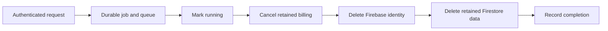

# Account lifecycle and export

An account transition crosses several local and hosted owners. The Mac's authorization snapshot identifies the active owner; Node separately establishes and revokes its runtime owner. A delayed response must not pick up whichever account happens to be active when it finishes.

## Export My Data

The local exporter collects paginated product projections, including conversations, Memories, tasks, goals, Chat journal/catalog, Focus and an allowlisted settings projection. It encodes a deterministic JSON document with sorted keys and explicit date/key strategies. It checks the captured authorization before serialization and again while holding the file-commit lease. The writer uses an atomic temporary-file path, and failures must leave no partial export.

Tests exercise complete pagination, repeatable output, owner revocation before writing, account transition waiting for physical commit, read/write failure cleanup and the settings allowlist. This is a local product export; hosted account metadata has a different API owner. Export does not require dumping raw databases or credentials.

## Hosted deletion

The authenticated delete-account route starts a durable deletion job. The worker first marks the wipe running, then composes billing cancellation, Firebase Auth deletion and retained Firestore deletion. A missing Firebase user is tolerated, but an incomplete Firestore wipe or unconfirmed billing cancellation must fail. The worker records failure for reconciliation rather than claiming completion after only some steps succeeded.

Deletion workers authenticate Cloud Tasks independently from the initiating user request. A successful HTTP acknowledgment is not evidence that every external deletion step completed. The [billing handoff](../integrations/billing.md) and [operational commitments](../../INSTRUCTIONS.md#unresolved-commitments) retain the live acceptance boundary.

For local account changes, review the [runtime owner barrier](../architecture/desktop-agent.md) and [GRDB authorization](../architecture/local-data.md) alongside export tests.

## Source evidence

- [desktop/macos/Desktop/Sources/Account/Export/LocalUserDataExport.swift](../../../desktop/macos/Desktop/Sources/Account/Export/LocalUserDataExport.swift#L267-L344)
- [desktop/macos/Desktop/Tests/LocalUserDataExportTests.swift](../../../desktop/macos/Desktop/Tests/LocalUserDataExportTests.swift)
- [backend/routers/users.py](../../../backend/routers/users.py#L108-L125)
- [backend/services/users/account_deletion.py](../../../backend/services/users/account_deletion.py#L52-L112)
- [backend/tests/services/users/test_account_deletion.py](../../../backend/tests/services/users/test_account_deletion.py)
- [backend/tests/unit/test_delete_account_billing_cancel.py](../../../backend/tests/unit/test_delete_account_billing_cancel.py)
- [backend/services/users/account_deletion.py](../../../backend/services/users/account_deletion.py#L184-L208)

[Start here](../../quickstart.md) · [Authored guidance](../../INSTRUCTIONS.md)
