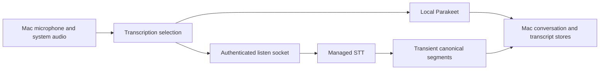

# Capture and transcription

Ambient capture and push-to-talk are different workflows. Ambient transcription produces the local conversation archive. PTT produces an interactive voice turn and has its own bounded recovery policy described in [Chat and voice](chat-voice.md).

## Ambient path

`AppState+Transcription` admits local capture and creates a conversation handle before starting transcription. Apple Silicon can use local Parakeet; Intel and local-model failures can take the cloud path. Microphone and system audio feed separate local transcription instances or the mixed cloud stream. Conversation finalization and the archive repository remain on the Mac.

Owner transition quiesces capture, including pending final-tail work, before moving authority. Meeting-ended and duration-boundary handling finalize local conversations rather than waiting for a backend conversation object. Capture lifecycle, retry and finalization need to be traced together when diagnosing missing tail audio.

## Transient cloud path

The retained `/v4/listen` route accepts an immutable language/translation/vocabulary snapshot and fixed audio transport. Its runtime supervises connection tasks, receives audio, manages provider/admission/usage status, and sends transient transcript events. Modulate final utterances become stable UUID segments with zero-based numeric speaker IDs; translation is keyed to those segments.

There is no client-conversation identity in the accepted socket query. The tests reject retired/unknown query fields, prove that a real route streams a segment plus keyed translation without product persistence, and preserve the original segment when translation fails. Usage/account facts still have a retained backend owner; that does not imply hosted conversation storage.

For a failure, identify whether admission, capture, transport, canonical segment delivery or local finalization failed. Follow `ConversationFinalizationService` into its local store and candidate-compute calls. A server WebSocket success alone cannot prove a durable conversation; a local synthetic test cannot prove physical microphone capture.

## Source evidence

- [desktop/macos/Desktop/Sources/AppState/AppState+Transcription.swift](../../../desktop/macos/Desktop/Sources/AppState/AppState+Transcription.swift#L67-L115)
- [desktop/macos/Desktop/Sources/AppState/AppState+Transcription.swift](../../../desktop/macos/Desktop/Sources/AppState/AppState+Transcription.swift#L150-L226)
- [backend/tests/unit/test_listen_transient_contract.py](../../../backend/tests/unit/test_listen_transient_contract.py#L120-L247)
- [backend/tests/unit/test_listen_transient_contract.py](../../../backend/tests/unit/test_listen_transient_contract.py#L376-L425)
- [backend/routers/listen/runtime.py](../../../backend/routers/listen/runtime.py#L57-L111)
- [desktop/macos/Desktop/Sources/ConversationFinalizationService.swift](../../../desktop/macos/Desktop/Sources/ConversationFinalizationService.swift)
- [desktop/macos/Desktop/Tests/ConversationIngestionTests.swift](../../../desktop/macos/Desktop/Tests/ConversationIngestionTests.swift)

[Start here](../../quickstart.md) · [Authored guidance](../../INSTRUCTIONS.md)
