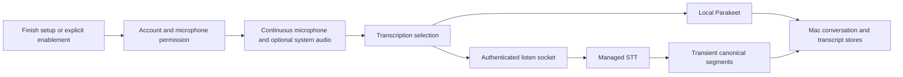

# Capture and transcription

Ambient capture and push-to-talk are different workflows. Ambient transcription produces the local conversation archive. PTT produces an interactive voice turn and has its own bounded recovery policy described in [Chat and voice](chat-voice.md).

## Ambient path

`AppState+Transcription` admits local capture and creates a conversation handle before starting transcription. Apple Silicon can use local Parakeet; Intel and local-model failures can take the cloud path. Microphone and system audio feed separate local transcription instances or the mixed cloud stream. Conversation finalization and the archive repository remain on the Mac.

Owner transition quiesces capture, including pending final-tail work, before moving authority. Stops and duration boundaries finalize local conversations rather than waiting for a backend conversation object. The four-hour conversation boundary rotates the local conversation and transcription producer while listening remains enabled; it is not a one-day listening expiry. Capture lifecycle, retry and finalization need to be traced together when diagnosing missing tail audio.

## Setup, controls and lifetime

Genuine onboarding has one **Finish setup** action. `SBOnboardingModel.complete()` accepts no mode argument and admits completion only once. Its exit plan enables listening and System Audio, requests Launch at Login and retains screen-analysis activation through existing account, key and permission gates. The completion opener says the app is configured for all-day listening; it does not claim that unavailable capture succeeded.

Global Skip persists an inactive outcome, stops listening and monitoring, and presents no completion opener. Launch restoration respects that outcome as well as explicitly disabled listening. A later explicit enablement retires the Skip fence. Settings default System Audio to on; turning it off keeps the microphone available. Home retains a single Listening on/off control. There is no meetings-only selection, waiting status or meeting-ended conversation boundary. Shared conferencing detection still throttles screen capture and detects screen sharing.

The existing `NSWorkspace` lifecycle observers stop capture on Mac sleep and request restart on wake only when listening was active before sleep and remains enabled. Lid closure while the Mac stays awake does not itself trigger this sleep path. Physical sleep/wake and closed-lid behavior need named-app evidence; source inspection and synthetic notifications alone do not establish hardware qualification.

## Capture reconciliation and recovery

`AppState` remains the capture owner. Reconciliation starts the microphone continuously and starts system audio only when enabled. Overlapping requests coalesce through the existing capture gate. Each asynchronous startup checks the recording generation before continuing, so an obsolete completion cannot stop or unlock a replacement session. Hardware-service identity checks undo stale starts. A required microphone failure stops listening; an optional system-audio failure records its permission outcome and leaves microphone capture running.

`AmbientCaptureLifecycleTests` exercises this implementation through hardware adapters with controlled startup completions. It checks independent System Audio disablement, both failure policies, stop during startup and replacement-session isolation. See [desktop verification](../testing/desktop-e2e.md#all-day-listening-coverage) for the separate genuine onboarding and physical audio checks.

## Transcript chronology

Provider delivery order is not spoken order. The live AppState projection and local archive both use `LocalTranscriptFormatter.chronologicallyOrdered`: start time first, original arrival order for equal-time segments, then stable input order. Live updates sort before publishing to the transcript monitor. Storage sorts the raw ingestion records before normalization joins adjacent fragments and assigns the saved display order.

A correction with the same segment ID retains its original arrival position, even when its timestamp changes. Live `arrivalOrder` and persistent `sourceOrder` keep that tie-breaker independent of the current display position. Existing keyed translations survive a text-only correction. The regression tests drive real AppState ingestion and GRDB writes, close and reopen the database, and compare the live/monitor order with the restored conversation. This establishes synthetic ingestion and persistence behavior, not natural microphone or provider qualification.

## Transient cloud path

The retained `/v4/listen` route accepts an immutable language/translation/vocabulary snapshot and fixed audio transport. Its runtime supervises connection tasks, receives audio, manages provider/admission/usage status, and sends transient transcript events. Modulate final utterances become stable UUID segments with zero-based numeric speaker IDs; translation is keyed to those segments.

There is no client-conversation identity in the accepted socket query. The tests reject retired/unknown query fields, prove that a real route streams a segment plus keyed translation without product persistence, and preserve the original segment when translation fails. Usage/account facts still have a retained backend owner; that does not imply hosted conversation storage.

For a failure, identify whether admission, capture, transport, canonical segment delivery or local finalization failed. Follow `ConversationFinalizationService` into its local store and candidate-compute calls. A server WebSocket success alone cannot prove a durable conversation; a local synthetic test cannot prove physical microphone capture.

## Source evidence

- [Onboarding completion and Skip](../../../desktop/macos/Desktop/Sources/Onboarding/SecondBrain/SBOnboardingModel.swift#L542-L605)
- [Completion effects](../../../desktop/macos/Desktop/Sources/Onboarding/OnboardingExitPolicy.swift#L78-L112)
- [Capture reconciliation](../../../desktop/macos/Desktop/Sources/AppState/AppState+Transcription.swift#L383-L532)
- [Sleep and wake](../../../desktop/macos/Desktop/Sources/AppState.swift#L493-L554)
- [Hardware-seam regressions](../../../desktop/macos/Desktop/Tests/AmbientCaptureLifecycleTests.swift#L5-L168)

- [desktop/macos/Desktop/Sources/AppState/AppState+Transcription.swift](../../../desktop/macos/Desktop/Sources/AppState/AppState+Transcription.swift#L67-L115)
- [desktop/macos/Desktop/Sources/AppState/AppState+Transcription.swift](../../../desktop/macos/Desktop/Sources/AppState/AppState+Transcription.swift#L150-L226)
- [backend/tests/unit/test_listen_transient_contract.py](../../../backend/tests/unit/test_listen_transient_contract.py#L120-L247)
- [backend/tests/unit/test_listen_transient_contract.py](../../../backend/tests/unit/test_listen_transient_contract.py#L376-L425)
- [backend/routers/listen/runtime.py](../../../backend/routers/listen/runtime.py#L57-L111)
- [desktop/macos/Desktop/Sources/ConversationFinalizationService.swift](../../../desktop/macos/Desktop/Sources/ConversationFinalizationService.swift)
- [desktop/macos/Desktop/Tests/ConversationIngestionTests.swift](../../../desktop/macos/Desktop/Tests/ConversationIngestionTests.swift)
- [desktop/macos/Desktop/Sources/AppState/AppState+ListenEvents.swift](../../../desktop/macos/Desktop/Sources/AppState/AppState+ListenEvents.swift#L1-L78)
- [desktop/macos/Desktop/Sources/Rewind/Core/LocalTranscriptFormatter.swift](../../../desktop/macos/Desktop/Sources/Rewind/Core/LocalTranscriptFormatter.swift#L12-L28)
- [desktop/macos/Desktop/Sources/Rewind/Core/TranscriptionStorage+LocalAuthority.swift](../../../desktop/macos/Desktop/Sources/Rewind/Core/TranscriptionStorage+LocalAuthority.swift#L58-L142)

[Start here](../../quickstart.md) · [Authored guidance](../../INSTRUCTIONS.md)
