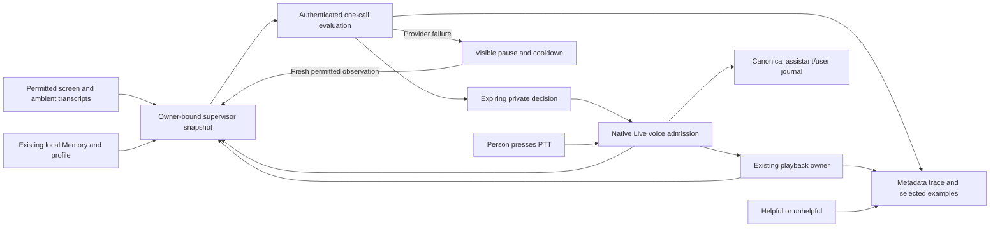

# Supervisor conversation

C is the person working, A is Intentive's native Gemini Live conversation, and B is the private supervisor. One complete interaction is: permitted screen/transcript evidence reaches B; B returns private guidance; A speaks through the existing voice owner; C replies or interrupts using PTT; B receives that exchange and its playback outcome. The [authored decision](../../INSTRUCTIONS.md#first-abc-interaction-decision) defines the product scope. This page describes its implementation.

## One bounded observation owner

`SupervisorService` is bound to a `RuntimeOwnerAuthorizationSnapshot`, logical session and application-context epoch. It keeps the latest permitted frame, app/window identity and capture time; up to 24 ambient segments from the last 120 seconds; and up to 16 direct conversation entries with terminal outcomes. Each evaluation reads up to twenty existing Memories and the latest profile through the same local authorities used by Chat. Empty reads are valid. B neither generates profiles nor invokes semantic search.

The capture plugin retains its existing permission, application exclusion, change detection and Rewind fan-out. A changed screen hash, settled app/window context, accepted transcript change or direct exchange marks the observation dirty. The scheduler coalesces for three seconds, admits one request at a time and keeps only the latest pending view. Same-context updates do not starve the in-flight interpretation; app/window, privacy, owner and session changes revoke its authority. Capture paths pin the context epoch before asynchronous work, including retry and older-macOS fallback paths.

When the capture plugin changes B's app/window context or revokes its screen, it also clears obsolete capture deduplication if the context epoch changed. Pending app-switch settling is preserved. Returning to identical pixels can therefore acquire a new permitted frame instead of leaving B without an image. A capture rejected for an obsolete epoch similarly resets deduplication after completion; it cannot restore the old context, and the independent Rewind write remains in place. Unchanged valid context keeps normal preview suppression. The capture trigger regressions cover returned windows, raw-title/window-identity changes, rejected captures, privacy revocation, idle gating and unchanged-screen deduplication.

Ambient corrections replace entries by session, producer and segment identity. Monotonic PCM sidecars map local/cloud decoder offsets back to capture intervals, including new producer identities after reconnect. Direct A–C capture/playback takes precedence: overlapping or unmappable segments are excluded from B only. Ambient recording, the live transcript and archive remain unchanged. This conservative suppression can omit unrelated speech during an A–C turn. See [capture and transcription](capture-transcription.md).

## A small private decision interface

`POST /v1/supervisor/evaluate` uses Firebase participant admission and shared desktop Gemini inference limits. The backend selects the configured supervisor workload, owns the output schema and performs one model call without tools. Its result is one of:

| Decision | Effect |
| --- | --- |
| `wait` | No guidance or speech |
| `guide_next_turn` | Keep a private note for the next admitted PTT input window |
| `intervene` | Attempt an idle supervisor-origin voice turn |

The response carries observation, session, context and decision identity plus the B prompt receipt. The client accepts it only while its captured authority and context remain current. Guidance expires thirty seconds after the observation's latest accepted change, including time spent loading context and evaluating. Only the latest pending note is valid. Invalid provider output becomes `wait`; a provider or transport failure produces no intervention. Ordinary PTT retains its independent admission path.

Provider failures are not successful `wait` responses. The backend first records a degraded observation with the decision, owner/session and prompt correlation, then returns fixed safe error text. Upstream `429` remains `429`; provider `401`, `402`, `403` and server failures become `503`; other rejected requests become `502`. Transport errors also become `503`. This preserves Firebase identity and desktop trial status while activating the existing visible Supervisor pause. Logs retain bounded failure categories, never provider bodies, exception text, credentials or local observation payloads.

The client pauses for sixty seconds and admits only fresh observations after that cooldown; it does not replay a stale private decision. The application's own daily Gemini quota remains distinct: its specific quota response pauses B for the logical session. Malformed model output and unavailable managed prompts still return degraded `wait` decisions. Endpoint regressions cover status mapping, one provider call, retained trace identity and private-content exclusion; coordinator tests cover cooldown, fresh input and daily-quota pause.

A private note is an internal expiring value, never a user message, notification card, resource attachment or ordinary log. Optional evaluation export is described below; it requires explicit current-session consent.

## Speaking and interruption

`RealtimeHubController.submitSupervisorGuidance` uses the existing voice reducer with `.supervisor` intent. It acquires turn, session, response and playback ownership without starting microphone capture or its timeout. Actual dispatch checks idle voice, current guidance, local notification permission, snooze and frequency. The Gemini Live transport sends one standalone `realtimeInput.text` message carrying private guidance and permitted context. Audio activity markers remain reserved for the PTT audio window. A connection containing an already completed or attempted response is replaced before another automatic turn.

PTT has immediate priority through the normal interruption owner. A `guide_next_turn` note is inserted when the next user input window opens and does not trigger a second response. Automatic turns reject tool execution in code. User-origin tools keep their existing authorization boundary; a private note is not user authorization.

If PTT requires a fresh Live connection after automatic output, the required replacement owns its three-second deadline and retained microphone input. The ordinary one-second warm timeout is cancelled during replacement. Accepted readiness records the input admission before the manager flushes captured PCM, preventing an unnecessary second replacement. A short rescue deadline remains until that flush is admitted; ordinary cold PTT retains its existing warm recovery.

The automatic note is consumed before transport submission. If initiation might have reached Gemini and the connection fails, that turn is cancelled without replay or batch transcription recovery. User PTT keeps its existing same-provider and bounded batch recovery. Automatic failure diagnostics record only the fixed admission/send/provider stage, bounded transport kind/domain/code and Boolean state; neither the note nor the raw provider reason is logged. [Chat and voice](chat-voice.md) explains both paths.

## History, delivery and improvement

Automatic speech records an assistant-only entry in the existing Node canonical journal through the controller's `TurnPersistence` extension. Its opaque continuity key relates it to the B decision; no invented C message or note is persisted. Provider completion plus actual PCM playback drain gates completed delivery. Journal-accepted generated text is saved as `completed`, while bounded `voiceDeliveryOutcome` metadata separately preserves completed, cancelled, failed or suppressed playback. Chat can restore “Interrupted”, “Voice reply incomplete” or “Not spoken”; a genuine journal failure retains its save warning. B receives the direct utterance and terminal playback outcome, with ambient overlap suppressed.

When user PTT falls back through batch transcription and Chat, the voice coordinator sends the journal-accepted user/assistant pair into this same bounded B snapshot. Observation authority is captured at the beginning of the physical turn and retained through provider completion; owner or supervisor-session changes reject delayed callbacks. Generation does not imply delivery: playback drain, cancellation or failure updates the existing exchange with its terminal outcome. This does not add a conversation store or a separate telemetry path.

Langfuse manages `intentive-live-system` and `intentive-supervisor-system`. The backend returns A's prompt receipt with the Live credential, and Swift pins it to that physical connection; B resolves its prompt per evaluation. The SDK cache serves available prompts. Cold failure preserves A's existing local conversation instructions and makes B return `wait` with an unavailable-prompt outcome. Executable permissions, tool authority and response schemas remain in code.

B's backend trace always exports metadata. A/Chat terminal outcomes, selected B examples and helpful/unhelpful feedback use the authenticated `/v1/ai/observations` intake. Normal sessions export identifiers, prompt versions, timing/count/outcome facts and scores. The session sharing control is off by default; explicit opt-in adds only bounded conversation/transcript/guidance text. Audio, screenshots, copied Memory/profile payloads, credentials and tool payloads are excluded. Owner/session end or sharing revocation invalidates queued content, including after re-enabling sharing. See [telemetry](../integrations/telemetry.md) for the exact ticket and correlation path.

## Retained product and verification

The five independent background workers, their scheduling, screen-derived record creation, cards, glows and worker-specific settings/prompts are retired. One Supervisor enable control replaces them. Observation settings remain separate from proactive-speech controls. Existing saved records, manual tools, archive/search, Rewind and independent conversation/Memory enrichment keep their owners.

Coordinator, timeline, voice, journal and export tests establish deterministic behavior. The manual `supervisor-conversation` flow separately requires a named development bundle, authenticated Gemini, physical PTT, speakers and headphones. Measure input-ready, evaluation-start and playback-start separately, and measure request volume before claiming all-day coverage. Source, offline tests, hosted prompt availability and physical acceptance are distinct evidence.

[Desktop verification](../testing/desktop-e2e.md) · [Providers](../integrations/providers.md) · [Start here](../../quickstart.md)
